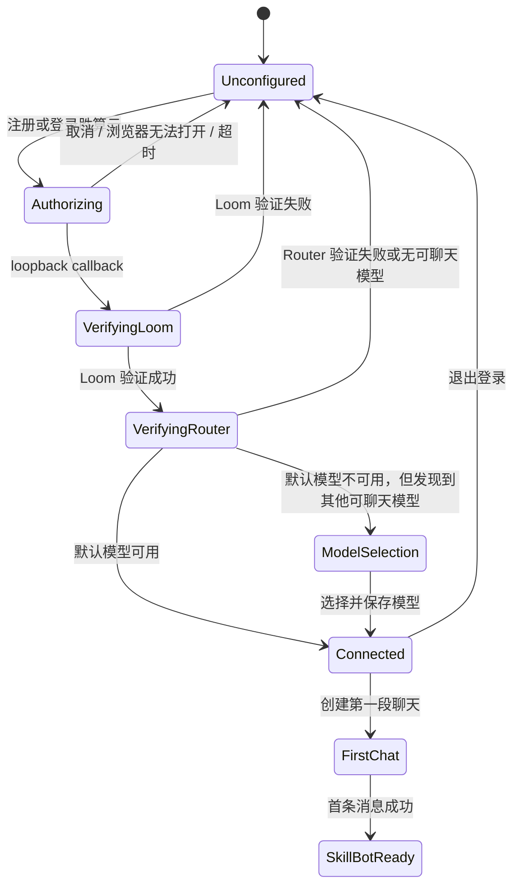

# Loomloom × DSH Desktop 首次注册、登录与首用规格

## 2026-09-11 回归修正

以下规则优先于本文中要求模型就绪后才能关闭 onboarding 的旧描述：

- 首次引导只以本 Profile 的凭据存在状态判断是否需要登录。已有凭据时完成引导，不等待 Loom/Router 网络探测，不因默认模型缺失而重新弹出登录。
- 凭据存在不等于服务或模型已就绪；Settings 继续展示完整验证状态。验证失败提供重试，不直接降级为未登录。
- 点击“打开模型设置”先完成并关闭引导，再打开原生 Models section，避免模态层遮挡设置。模型选择阶段允许稍后处理或 Escape 退出。
- 登录仍由 Host 验证后统一写入 credentials 引用，前端不接触明文 Key；不修改新授权事务的取消、所有权或回滚规则。
- 回归覆盖：已保存 Key 时不发远端 bootstrap；无 Key 的首次登录；网络失败；未选默认模型；完成引导后打开模型设置的调用顺序。

## 1. 目的与完成定义

本规格定义未登录用户从首次启动 DSH Desktop，到注册或登录胜算云、取得经过验证的凭据、创建第一段可用聊天、再发现并使用 Loomloom SkillBot 的完整体验。它补充 [集成规格](loomloom-integration-spec.md) 的身份、模型和客户端章节；若有冲突，以本规格的首次用户流程为准。

完成不等于“浏览器授权页已打开”，也不等于“Loom API 可访问”。仅在下列条件全部成立时，界面才可显示“已连接，可以开始聊天”：

1. 用户已在胜算云第一方网页完成注册或登录与授权；
2. Host 已在 loopback PKCE 回调中安全兑换到 API Key，Key 从未进入 Renderer、URL、日志或错误详情；
3. Host 使用该 Key 分别验证 Loom API 和胜算云 Router 的模型发现接口；
4. 有一个可用于新建聊天的胜算云聊天模型被保存为 DSH 默认选择；
5. 用户能从成功页直接创建聊天，并在聊天内发现、准备、确认和查看 Loomloom SkillBot 结果。

胜算云账号注册属于胜算云的第一方网页；Desktop 不收集密码、验证码、手机号或个人资料，也不内嵌仿冒的注册表单。

## 2. 当前实现与缺口

现有 `dsh-plugin-loomloom` 已提供安全基础：随机 loopback 端口、PKCE S256、state、一次 callback、5 分钟浏览器授权超时、10 分钟短时会话，以及将 Token 写入 DSH credentials 的 Host-only 流程。桌面 bundle 也已预置 `shengsuanyun` Provider，并将 `deepseek-v4-flash` 配为首选模型。

但首次用户不能稳定完成闭环，原因如下：

| 优先级 | 现状 | 用户影响 | 本规格的处理 |
|---|---|---|---|
| P0 | 设置页首次加载并行读取凭据、SkillBot 与 runs；后两项在无 Key 时失败 | “尚未登录”被泛化为加载失败 | 未配置时只读取无凭据 bootstrap 状态，展示明确的注册/登录入口 |
| P0 | 浏览器回调后只验证 Loom `/users/me/runs` | Loom 可用但 Router 不可用时仍显示成功，首聊失败 | 保存前同时验证 Loom 和 Router `/models` |
| P0 | API Key 粘贴分支不做验证就保存和设默认模型 | 无效 Key 产生伪登录状态 | 浏览器和粘贴两种来源复用同一验证与模型选择流程 |
| P1 | 设置页是唯一入口；轮询没有取消动作 | 新用户难以发现，关闭浏览器后只能等待超时 | 使用公开 `settings.onboarding` slot 提供首启入口；增加取消、重试和超时恢复 |
| P1 | 成功后没有“创建第一段聊天”下一步 | 用户不知道已登录如何使用 | 成功页提供单一主操作，首聊后再引导 SkillBot |

禁止修改 `deepseek-harness/`。上游已公开 `settings.onboarding` slot，且其 owner 支持 `complete()` 与 `openSection('models')`；实现只能在 `dsh-plugin-loomloom/` 注册该 slot 和使用已发布的服务。

## 3. 用户旅程与状态机

### 3.1 主路径

1. 用户创建或选择一个 DSH Profile 后首次进入 Desktop。
2. 若 `SHENGSUANYUN_API_KEY` 未配置，Loomloom onboarding 显示“连接胜算云，开始使用 Loomloom”，并说明“一把 API Key 同时用于聊天模型和 Loomloom”。主按钮必须写为“注册或登录胜算云”，而不是只写“登录”。
3. 用户点击主按钮。Desktop 通过系统默认浏览器打开胜算云授权 URL；Desktop 保持在“正在等待浏览器完成”的页，并明确告知可注册新账号、完成后会自动返回 Desktop、不会要求复制 Key。
4. 用户在胜算云第一方页面注册或登录、批准授权。浏览器被重定向到 `127.0.0.1` callback 页面；该页仅告知“授权信息已收到，请返回 DSH”，不显示 code、state 或 Key。
5. Host 依次兑换 Key、验证 Loom、验证 Router 和可用模型、保存 Key，并保存可用默认模型选择。
6. Desktop 显示“胜算云已连接”，列出非敏感的验证结果（`Loomloom 可用`、`聊天模型可用`），主按钮为“创建第一段聊天”。
7. 用户点击后关闭设置/onboarding，进入原生 DSH 新聊天入口；新会话使用保存的 `shengsuanyun` Provider 与模型。首条消息发送成功后，非阻塞提示说明“需要批量处理时，在聊天中说‘使用 Loomloom SkillBot…’”。



### 3.2 分支与恢复

| 情况 | 立即反馈 | 可恢复操作 |
|---|---|---|
| 用户尚未有胜算云账号 | 浏览器页承担注册；Desktop 文案明确支持注册 | 回到 Desktop 后继续自动验证 |
| 浏览器未能打开 | 内联错误：“无法打开系统浏览器” | 复制授权链接、重试、取消 |
| 用户关闭浏览器或拒绝授权 | 点击“取消等待”立即终止 loopback listener | 回到未配置页；可重新发起 |
| 5 分钟授权超时 | “未在规定时间完成授权” | 重试；旧 session 不可恢复或重放 |
| Loom 验证失败 | “该 Key 无法访问 Loomloom，请重新授权” | 不保存 Key；重试或取消 |
| Router 验证失败 | “该 Key 无法访问胜算云聊天模型” | 不保存 Key；重试或取消 |
| 默认模型已下线、但 Router 有其他聊天模型 | “请选择一个可用模型” | 打开 `设置 → 模型` 的现有发现和选择体验；选择后才完成 onboarding |
| Router 没有任何兼容聊天模型 | “账号当前没有可用聊天模型” | 不保存为已连接；重试或联系胜算云支持 |
| 网络短暂失败 | 使用稳定错误码和简单说明，不展示上游 body | 重试；不自动发起新的授权或付费 SkillBot 执行 |
| 用户退出登录 | 清除本 Profile 的 credential 和 Loom 状态 | 立刻重回未配置引导；不删除其他 Provider 的用户选择 |

“以后再说”可以关闭本次 onboarding，但不得把未连接状态伪装成已连接：设置页和聊天空状态仍应显示“连接胜算云”入口。

## 4. 界面、可访问性与文案

### 4.1 首次引导

Loomloom 注册 `settings.onboarding` 项，建议 ID 为 `loomloom-connect`、顺序在上游 `welcome-notice`（`-100`）之后、`deepseek-official`（`0`）之前或与其合并排队。是否替代 DeepSeek 的上游引导必须以当前 profile 的 credential 状态决定；不可覆盖用户已明确配置的其他 Provider。

页面必须包含：

- 标题：`连接胜算云，开始聊天与 Loomloom`；
- 说明：`注册或登录后，胜算云 API Key 将安全保存在此 DSH Profile 中，同时用于聊天模型与 Loomloom。`；
- 主按钮：`注册或登录胜算云`；
- 次操作：`暂不连接`；
- 一个可展开的“这会发生什么”说明：系统浏览器、授权回调、双端验证、可随时在设置中退出；
- 隐私提示：不收集或展示密码、验证码、API Key。

若页面由 Settings 进入而非 onboarding，复用同一连接组件和状态机；不维护两套登录轮询逻辑。

### 4.2 等待、错误和成功

等待页显示步骤进度：`等待浏览器授权 → 验证 Loomloom → 验证聊天模型 → 保存设置`。等待时提供 `取消等待`，取消后焦点回到“注册或登录胜算云”。

错误必须紧邻发起操作显示，以 `role="alert"` 或等价可访问告警暴露，且关联到主按钮的 `aria-describedby`。错误文本须给出下一步，而不能只显示“请求失败”。键盘焦点、Enter/Space、焦点可见性、系统缩放和屏幕阅读器顺序必须完整支持；不要用只有颜色含义的状态。

成功页显示两个非敏感勾选状态和“创建第一段聊天”。调用 `SettingsSectionOwnerProps.close()` 关闭设置后，客户端调用现有 DSH 原生新聊天入口；不能伪造一个聊天会话或将 API Key 作为 prompt 注入。若原生新聊天入口无法从该 slot 调用，保留一个关闭设置后的明确 `新建聊天` 指引，并将其列为发布阻断项，不能以“已连接”替代首聊验证。

## 5. Host 与 Client 契约

所有 `/api/loomloom/*` 路由继续只允许 DSH Web carrier 的 same-origin loopback 请求，响应包含 `cache-control: no-store` 和 `x-content-type-options: nosniff`。任何 telemetry、异常、DOM 状态、status/bootstrap 响应均不得包含 Key、OAuth code、PKCE verifier、state、Authorization header 或上游原始 body。唯一例外是 `login/start` 的短时授权 URL：它必须将 state 作为浏览器回调绑定的一部分交给用户发起的外部浏览器打开流程，但 Client 不得将该 URL 渲染、记录或持久化。

### 5.1 Bootstrap

新增 `GET /api/loomloom/bootstrap`，用于首次 UI 决策，替代未认证时并发拉取 market/runs：

```ts
type LoomBootstrap = Readonly<{
  credential: Readonly<{ configured: boolean }>
  loom: 'unknown' | 'ready' | 'unavailable'
  router: 'unknown' | 'ready' | 'unavailable'
  model: Readonly<{ provider: 'shengsuanyun'; id?: string; ready: boolean }>
}>
```

- 未配置只返回 `configured:false` 和其他字段 `unknown`，返回 `200`，不是 UI 错误。
- 已配置时可有界验证状态；网络不可用则返回 `unavailable`，但不删除凭据。
- 店面浏览（`GET /api/loomloom/storefront`）**不需要**登录：它只读取公开 Market 数据，`GET /marketListings/{id}` 本身接受匿名请求。店面页因此不得以 `credential.configured` 作为渲染前提，也不得在首屏等待 `/bootstrap` 或 `/credentials`。
- runs、报价与执行仍只在 `credential.configured === true` 后发起；`401` 转为可操作的“重新连接胜算云”状态，而非列表加载错误。凭据状态在用户点击“立即调用”时才读取。

### 5.2 授权会话

保留 `POST /api/loomloom/login/start` 和 `GET /api/loomloom/login/status?sessionId=`，并新增 `POST /api/loomloom/login/cancel`。`sessionId` 为 32 位 base64url 不透明 ID；最大 3 个 pending session；所有终态在短时 TTL 内可查询，随后删除。

```ts
type BrowserLoginState =
  | 'pending'
  | 'verifying-loom'
  | 'verifying-router'
  | 'model-selection-required'
  | 'complete'
  | 'cancelled'
  | 'failed'

type BrowserLoginStatus = Readonly<{
  state: BrowserLoginState
  reason?: 'browser-unavailable' | 'authorization-cancelled' | 'authorization-timeout'
    | 'loom-validation-failed' | 'router-validation-failed'
    | 'no-chat-model' | 'credential-save-failed'
}>
```

- `cancel` 必须 abort session、关闭 loopback listener、使 callback 和交换结果失效；对不存在或已终态 session 采用幂等成功响应，避免泄露 session 存在性。
- 页面轮询仅在 `pending` / 验证态存在，每 1–2 秒一次；组件卸载、取消、终态、Profile 切换、Host generation dispose 时清除 timer 和 AbortController。
- Client 先以 `window.open(url, '_blank', 'noopener,noreferrer')` 尝试打开，若被拦截则提供复制链接。真正的外部打开仍由 Desktop shell 的 `shell.openExternal` 策略处理，不能让 renderer 访问 Electron IPC。

### 5.3 双端验证和保存顺序

`verifyBrowserCredential()` 必须拆分为可单测的两项 Host-only 验证，并让浏览器授权和 API Key 粘贴流共用同一事务：

1. 调用受限 Loom endpoint（当前 `/users/me/runs?pageSize=1`）确认 Loom API 可用；
2. 使用同一 Key 对固定 `https://router.shengsuanyun.com/api/v1/models` 发出 `GET`，限制响应体大小、校验 JSON 结构，并筛出兼容 chat-completions 的模型；
3. 若预置 `deepseek-v4-flash` 存在且可聊天，选择它；否则进入 `model-selection-required`，通过 DSH 已有 Models section（`openSection('models')` 与 `llm/discoverModels`）让用户至少保存一个发现的胜算云模型；
4. 仅当 Loom 和 Router 均通过验证后，才调用 `storeLoomToken()`；默认模型选择成功后才将会话置为 `complete`。

若模型选择需要先保存 Key 才能让 DSH Models section 发现模型，保存后状态必须仍为 `model-selection-required`，不是 `complete`；退出、失败或超过限定时间要清除这次事务新写入的 Key，不能覆盖用户原有的已验证 Key。保留和恢复已有 Key 的规则必须以 credential revision/session ownership 判断，绝不按字符串比较 Key。

不要在插件中静态复制完整模型列表。胜算云 Router 的 `/models` 是动态目录；首用仅保证一个已验证模型，用户随后在“设置 → 模型”用现有模型发现界面添加或切换更多模型。

API Key 粘贴是辅助恢复方式，须标记为“已有 API Key”；secret input 禁止自动填充、回显、复制到剪贴板或进入 UI state，并执行完全相同的 Loom + Router 验证、保存和模型选择流程。

## 6. 登录后首用与 SkillBot 衔接

首聊是认证验收的一部分，而非另一个隐蔽的手工步骤：

1. 首个新聊天读取已保存的 `agentDefaultModel`，应解析为 `shengsuanyun` 和已验证模型；
2. 用户发送普通文本，出现可用的模型回答；若模型调用失败，聊天错误必须带“打开模型设置”与“重新连接胜算云”的恢复入口；
3. 在同一聊天中，用户可以要求“列出可用 Loomloom SkillBot”或描述批量任务；Agent 按现有 `发现 → 草案 → 明确确认 → 执行 → 结果回传` 契约运行；
4. 认证成功绝不代表已授权执行付费 SkillBot，执行仍需每次明确确认。

用户可在 Loomloom Settings tab 查看连接状态、最近 runs、退出登录和重新连接；已连接时才加载 market/runs。退出登录后不自动改写其他 Provider 的选择，但任何使用胜算云凭据的模型请求必须显示可恢复的未连接状态。

## 7. 实现边界与迁移计划

| 范围 | 变更 |
|---|---|
| `dsh-plugin-loomloom/src/client/` | 新增可复用的 `LoomloomConnectFlow`；在现有 Settings tab 和 `settings.onboarding` slot 使用；提供状态、取消、无障碍提示和首聊 CTA |
| `dsh-plugin-loomloom/src/browser-login.ts` | 扩展会话状态、取消、终态原因、事务所有权与生命周期清理 |
| `dsh-plugin-loomloom/src/browser-auth.ts` | 将 Loom 与 Router 验证拆分；限定 Router 模型响应；保留 PKCE/state/loopback 安全属性 |
| `dsh-plugin-loomloom/src/authorization.ts` | API Key fallback 复用验证事务，不可先保存后验证 |
| `dsh-plugin-loomloom/src/routes.ts` | 增加 bootstrap/cancel，稳定化无密钥和终态错误响应 |
| `dsh-plugin-loomloom/tests/` | 覆盖状态机、双验证、清理、前端可访问性和首聊选择 |
| `dsh-plugin-desktop/` | 仅保持 Provider/default-model bundle 注册；不放登录业务逻辑 |
| `deepseek-harness/` | 不修改 |

实现应先交付 Host 状态机和测试，再接入共享 UI，最后进行打包版人工验收。所有结构性改动先进入 Desktop beta bundle，验证后再同步 stable bundle，遵守 `dsh-desktop/AGENTS.md` 的发布流程。

## 8. 测试与验收

### 8.1 自动化测试

- 未配置 bootstrap 返回 `200` / `configured:false`，Settings 不请求 market/runs，也不显示笼统错误；
- 浏览器和 API Key 两种来源均验证 Loom、Router、模型选择后才写入 credential/default model；任一步失败时不保留新 Key；
- Router 测试覆盖有效模型、空数组、默认模型缺失、超大 body、无效 JSON、401/429/5xx、Abort；
- login start/status/cancel 覆盖并发上限、状态转换、取消幂等、超时、重复 callback、state mismatch、PKCE exchange failure、Profile/generation dispose；
- Client 覆盖主按钮、浏览器弹窗被拦截后的复制链接、取消时清除轮询、每个错误的恢复 CTA、`role=alert`、键盘导航和焦点返回；
- 首聊选择测试断言保存的 Provider/model 被新会话读取；旧会话不被静默改写；
- 安全回归断言所有 JSON、日志 mock、错误和 rendered DOM 中不含 Key、code、verifier、state 或 Authorization 值。

### 8.2 打包 Desktop 人工验收

使用全新 DSH Profile、尚未登录的胜算云测试账号和无费用测试 SkillBot：

1. 启动 Desktop，完成/跳过产品欢迎页后看到“连接胜算云”引导；
2. 从 Desktop 点击“注册或登录胜算云”，确认系统浏览器打开第一方页面；用新账号完成注册、登录和授权；
3. 回到 Desktop，依次看到 Loom 与聊天模型验证成功，且不出现 Key；
4. 点击“创建第一段聊天”，发送一条普通问题并收到胜算云模型回复；
5. 在同一聊天发现测试 SkillBot、生成草案、拒绝一次，再重新生成并明确确认一次；核对 run 结果回到该聊天；
6. 重新启动 Desktop，确认同一 Profile 保持已连接但仍不展示 Key；退出登录后确认引导恢复；
7. 在授权等待页分别测试取消、关闭浏览器、网络断开和超时；每种情况均可返回重试，且没有悬挂 listener/timer 或误保存凭据。

发布门槛：上述自动化测试、`corepack yarn workspace dsh-plugin-loomloom typecheck`、`corepack yarn workspace dsh-plugin-loomloom test`、`corepack yarn check` 均通过；人工验收使用测试账号和零费用 Listing，不对生产付费 Listing 运行测试。
