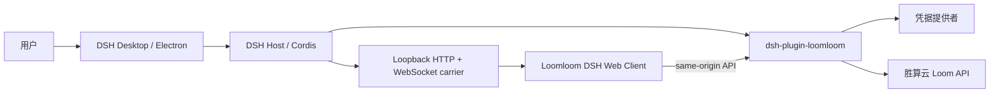

# Loomloom × DSH Desktop 集成规格（MVP → v1）

## 1. 目标与边界

在不修改 `deepseek-harness/` 上游子模块的前提下，将现有 Loomloom 的胜算云市场、SkillBot 执行和运行结果能力提供为标准 DSH 插件。DSH Desktop 继续拥有 Electron、窗口、托盘、Profile、Web carrier 和更新；`dsh-plugin-loomloom` 只拥有胜算云集成。

最终成功标准是：用户可在 DSH Desktop 的聊天界面与 DSH Agent 对话；Agent 能发现和理解 Loomloom SkillBot 的输入 schema、根据用户意图准备调用，并在用户明确确认后唤起对应 SkillBot。运行 ID、进度、结果摘要和产物链接会回到同一聊天会话。凭据不出现在浏览器页面、日志、错误对象或 URL 中。

不在 v1 范围内：修改 DSH 上游源码、嵌入旧 Tauri 应用、向局域网暴露未经鉴权的 Loomloom 执行接口、在没有明确确认时代表用户发起可能收费的执行、实现创作者上架/审核后台。

## 2. 组件与数据流



浏览器客户端只调用 DSH Host 注册的同源 `/api/loomloom/*` 路由。它不得直接请求胜算云、读取环境变量或使用 Electron IPC。Host 以 `Authorization: Bearer <token>` 调用配置的 Loom API。

## 3. 配置与身份

插件配置：

```yaml
- id: loomloom
  name: dsh-plugin-loomloom
  config:
    baseUrl: https://loomloom.shengsuanyun.com/loom/v1
    tokenRef: SHENGSUANYUN_API_KEY
```

- `baseUrl` 必须为无用户名、无密码、无 fragment 的 HTTPS URL；默认生产 API。
- 生产配置优先使用 `tokenRef`。`tokenEnv` 是旧配置兼容别名；`token` 仅允许作为本地开发临时配置，发布版 UI 不展示也不回传。
- 当前 token 引用由 DSH `credentials` 服务按每个上游请求解析。默认 `SHENGSUANYUN_API_KEY` 与 DSH Models 页的 Provider ID `shengsuanyun` 派生引用一致：同一把胜算云平台 Key 可同时供 Loomloom Market 和 Router 模型调用，不复制或回显密钥。浏览器授权使用 loopback PKCE（fresh verifier + state）、仅一次 callback，并使用胜算云实际的 `router.shengsuanyun.com/auth?from=CH_B51KXQ98` 与 `/auth/keys?from=CH_B51KXQ98` 兑换；兼容 `data.data.api_key` 响应。浏览器 callback 页面只表示已收到授权，只有凭据状态变为 configured 才表示成功。得到的凭据先通过配置的 Loom API 验证，再保存为该 DSH credential reference。不会复用旧应用的 `config.json`。
- Host 日志只记录请求操作、状态码和安全错误码，绝不记录 Authorization header、Token、OAuth code、完整响应体或输入行中的敏感字段。

## 4. Host API 契约

所有路由只能从 DSH Web carrier 的 loopback same-origin 请求；失败均使用 JSON，且响应包含 `content-type: application/json`、`cache-control: no-store`、`x-content-type-options: nosniff`。

| 路由 | 方法 | 认证 | 请求 | 成功响应 | 失败 |
|---|---|---|---|---|---|
| `/api/loomloom/health` | GET | 同源 | — | `{ok:true}` | 403/405 |
| `/api/loomloom/credentials` | GET | 同源 | — | `{configured:boolean,source?}`，不含 Token | 403/405/502 |
| `/api/loomloom/market` | GET | 同源 + Host Token | — | 上游公开市场 payload | 401/502 |
| `/api/loomloom/market/skillbot?listingId=` | GET | 同源 + Host Token | 严格 ID | 上游单个 SkillBot payload | 400/401/404/502 |
| `/api/loomloom/runs` | GET | 同源 + Host Token | — | 上游 runs payload | 401/502 |
| `/api/loomloom/runs/status?runId=` | GET | 同源 + Host Token | 严格 ID | 上游单次 run payload | 400/401/404/502 |

当前未暴露浏览器执行路由：在 Web Client 接入与 DSH approval contract 完整贯通前，Host 只允许聊天工具发起执行，杜绝同源页面绕过审批。未来的 Web Client 必须先调用 Market quote，并由 Host 签发短时、单次、会话绑定确认凭据；不能直接转发 `confirm:true` 至上游。

## 5. DSH 聊天唤起 SkillBot 的 Agent Tool 契约（核心交付）

当用户在 DSH 聊天中表达“用某个 Loomloom SkillBot 处理这份输入”时，Agent 按 `发现 → 准备 → 确认 → 执行 → 回传` 工作，不能跳过任一步。首批工具：

| 工具 | 作用 | 副作用 | 用户确认 |
|---|---|---|---|
| `loomloom_list_skillbots` | 查询可用 SkillBot、简介、价格与输入 schema | 无 | 否 |
| `loomloom_get_skillbot` | 查询指定 SkillBot 详情与版本 | 无 | 否 |
| `loomloom_get_run` | 查询运行状态/结果摘要 | 无 | 否 |
| `loomloom_get_run_results` | 查询结果行汇总与输出 artifacts，不回显输入行 | 无 | 否 |
| `loomloom_prepare_execution` | 校验输入、调用 Market quote，生成带成本/行数/版本的执行草案 | 无 | 否 |
| `loomloom_execute_skillbot` | 提交已确认草案，返回 `runId` | 可能产生费用 | 必须 |

工具实现必须使用 pinned DSH runtime 的官方 tool/approval contract。当前草案短时有效，绑定 `listingId + listingVersionId + inputRows hash + 生成时的 clientRequestId + DSH Agent object`；Agent 不能自行伪造、篡改或重复消费它，且仅 `allowed-once` 的 DSH approval outcome 才会触发上游调用。执行工具回传 `runId` 后会用有界指数退避自动轮询；终态时将状态、行数摘要与 artifacts 发送到同一聊天会话，AbortSignal 取消或预算耗尽则返回 `pending`，不会重复调用付费 execute。Agent 仍可按需调用 `loomloom_get_run` 和 `loomloom_get_run_results`。

聊天验收示例：

```text
用户：用「小红书文案生成」SkillBot 为这款咖啡机写 3 条种草文案。
Agent：发现该 SkillBot，补齐输入后生成执行草案：3 行，预计 ¥X，使用版本 V。
用户：确认执行。
Agent：已唤起 SkillBot（runId=...）；完成后返回 3 条文案和结果文件链接。
```

## 6. Web Client 规格（v1）

新增 `dsh-plugin-loomloom/client`，按 DSH 的普通 Web Client slot/locale 模式实现：

1. 设置页：加载凭据“未配置/已配置”状态、市场项、可运行状态、简介和固定费用，并有 loading/error/empty 状态；同时显示最近运行和安全的状态刷新入口。
2. SkillBot 详情：解析 `inputSchemaSnapshot`，只展示公开字段（key、类型、必填、枚举、说明）；不渲染或泄露内部工作流。
3. 页面明确引导用户回到 DSH 聊天中准备输入、取得服务端报价和批准；不存在浏览器 `execute` 路由或执行按钮。
4. 浏览器授权由插件受控的同源 Host route 触发，Client 只收到短时会话 ID 和授权 URL；Token 永远不进入 Client 状态或响应。

## 6.5 胜算云模型 Provider 与 DSH 聊天

桌面 bundle 已按胜算云的官方 DSH 配置预置 `llm-pi-ai` Provider `shengsuanyun`：协议为 `openai-completions`，Base URL 为 `https://router.shengsuanyun.com/api/v1`，默认模型为 `deepseek/deepseek-v4-flash`。该 Provider 的 `apiKeyEnv` 是 `SHENGSUANYUN_API_KEY`，与 Loomloom 默认 `tokenRef` 相同；每次请求由 DSH `credentials` 服务解析，不从旧的 DSH 配置文件读取密钥。成功 Loomloom 登录后，Host 会调用 DSH `agentDefaultModel.saveSelection()` 保存该模型给**新建**聊天，因此旧的 `agent-default-model` user settings 不会继续把聊天留在 `deepseek-official`。用户之后仍可在「设置 → 模型」改选模型或覆盖路由，但不应再次粘贴密钥。

用户通过 Loomloom 登录获得胜算云 API Key 后，新建 DSH Chat / Agent 默认使用该 Provider 和模型。模型选择和 Market 登录都先验证各自 endpoint 的授权，不能因为一端成功便假定另一端已授权；旧会话不被静默改写。

未登录用户的注册、浏览器授权、双端验证、首聊与 SkillBot 首用流程，以及可访问性、取消和恢复要求，见[首次注册、登录与首用规格](loomloom-first-run-auth-spec.md)。

UI 只使用 Host 路由；不复制旧 `assets/js/app.js` 的路由和 localStorage Token 逻辑。原始 Loomloom UI 可作为视觉和字段映射参考。

## 7. 安全与可靠性要求

- API base URL 仅在 Host 配置，HTTPS-only；不接受页面传入的任意 URL。
- 对入站 JSON 设置 64 KiB 上限，对上游 JSON 设置 2 MiB 上限；后续批量输入要采用文件上传协议并另行设计限制。
- 对 `listingId`、`runId`、`clientRequestId` 使用不透明字符串校验和 `encodeURIComponent`；不拼接 shell、SQL 或文件路径。
- 上游错误转为有限、可本地化的错误信息；禁止回显上游原始 headers/body。
- GET 为可重试请求；执行只可用相同 `clientRequestId` 幂等重试。网络重试采用有限次数退避，不能在用户未知的情况下创建新请求 ID。
- DSH profile/mode 切换会销毁 Host generation；插件不得跨 generation 缓存 service、fetch controller、timer 或 OAuth pending state。

## 8. 旧 Loomloom 授权链路验证与迁移门槛

旧 Go/Tauri 登录流程可作为上游协议参考，但不得直接搬入插件。已在 2026-09-08 使用胜算云浏览器授权完成受控验证：CLI 使用 `127.0.0.1` 随机端口 callback、PKCE S256 和 state；授权成功后 Doctor 返回 `healthy=true`、`token_valid=true`。测试记录不包含 URL state、code、Token、Cookie 或用户信息。

已确认：OAuth `state`、PKCE S256、动态 loopback 端口和 API key 兑换 payload（`code`、`code_verifier`、`callback_url`）。DSH callback 严格比对 state，只接收一次 GET callback，且流程终止时关闭 listener。仍需在打包版 DSH Desktop UI 中验证授权 surface 的浏览器打开与取消/超时提示。

迁移实现必须淘汰旧 `config.json` Token 存储、无 `state` callback、未使用的 Tauri 深链回调路径和重复的状态轮询探测。

## 9. 测试与验收

最低测试集：

- 配置：拒绝非 HTTPS URL、无凭据 URL、空 token；环境变量 token 被读取但不会序列化到状态响应。
- API Client：Bearer header 只发送给配置 origin；路径逃逸、超大响应、无效 JSON、401/429/5xx 的处理。
- Routes：拒绝非同源、错误 method、超大 body、非法 IDs、遗漏/重复执行 ID；执行 payload 始终携带 `confirm:true`。
- UI：schema 控件、必填校验、确认弹层、同一执行按钮去重、状态轮询清理。
- 生命周期：DSH Desktop 启动、插件安装/加载、Profile 切换、Desktop 退出；不修改上游子模块。
- 聊天调用：测试 DSH tool discovery、schema 解析、草案生成、批准/拒绝、确认 token 重放/篡改拒绝、上游执行、run 完成与聊天结果回写。

已实现的无费用工具链 smoke 覆盖“发现 → schema → quote 草案 → DSH 拒绝 → run 状态/结果读取”，并断言不存在 `:execute` 上游调用。它使用 mocked Loom API，因而不需要用户凭据也不会创建 Market run：

```bash
corepack yarn workspace dsh-plugin-loomloom test --test-name-pattern='complete no-charge chat smoke path'
```

真实端到端验收仍需要一个专用、零收费的测试 Listing 和测试账户。届时只将该 Listing 用于一次获得明确 DSH 允许后的执行，再轮询至终态并核对聊天中的 run 状态、结果摘要和 artifact 链接；不得对生产 Listing 运行 smoke。

验收命令在具备 Corepack/Yarn 后运行：

```bash
corepack yarn install --immutable
corepack yarn workspace dsh-plugin-loomloom typecheck
corepack yarn workspace dsh-plugin-loomloom test
corepack yarn check
```
